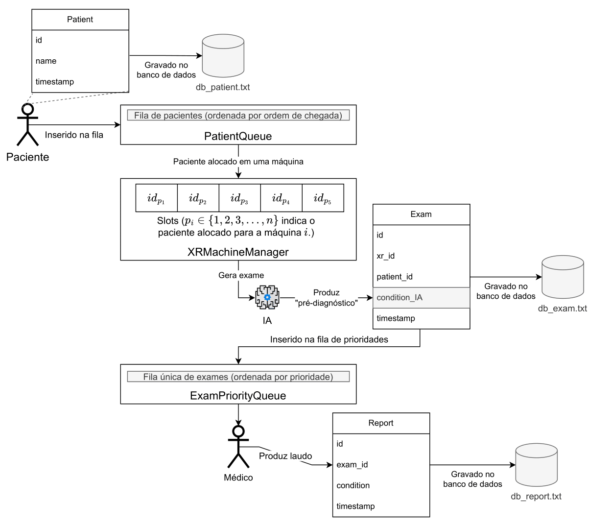

# X-Ray Exams
Este código em C consiste em simular o processo de realização de exames de raio-X de tórax em um hospital, com ênfase na organização da fila para laudo médico.

## Fluxo da Simulação
Uma representação gráfica da simulação do Hospital:



## Detalhamento da Simulação

A lógica da simulação pode ser encontrada na arquivo [main.c](./main.c).

 <ol type="1">
  <li>[Relatório](./main.c?#L77): É feita a checagem se está na hora de mostrar o relatório na tela.</li>
        <ol type="a">
            <li>Caso seja, o relatório é mostrado na tela.</li>
            <li>O Programa aguarda por volta de 5 segundos para retomar a simulação.</li>
        </ol> 
  <li>[Chegada de pacientes](./main.c?#L84): É gerado um número entre 0 e 4, onde, caso o número seja 0 é satisfeita a condição de chegada de um novo paciente (1/4, 20%).</li>
        <ol type="a">
            <li>É criado um novo ponteiro para a TAD Patient.</li>
            <li>A função create_patient() antes de retornar o ponteiro, salva um novo registro do paciente no arquivo db_patient.txt.</li>
        </ol> 
  <li>[Fila de pacientes](./main.c?#L98): Após chegar um paciente, ele é inserido na fila, TAD Queue, genérica, de pacientes, logo após cadastro.</li>
  <li>[XRMachineManager](./main.c?#L103): Foi implementado dois arrays para seu funcionamento.</li>
        <ol type="a">
            <li>Um [array de Patient*](./main.c?#L109), com 5 posições, para pacientes.</li>
            <li>Um [array de inteiros](./main.c?#L110), com 5 posições, para salvar em qual momento tal máquina terá terminado o exame.</li>
            <li>[Um loop](./main.c?#L103) para percorrre os arrays encontrar uma máquina de Raio-X disponível.</li>
            <li>[Outro loop](./main.c?#L115) para encontrar uma máquina de Raio-X que terminou o exame.</li>
        </ol>
    <li>[Exam](./main.c?#L122): Os exames são criados assim que o paciente termina o uso da máquina de Raio-X.</li>
        <ol type="a">
            <li>É criado um novo ponteiro para o TAD Exam.</li>
            <li>A função create_exam() salva o exame no arquivo db_exam.txt.</li>
        </ol>
     <li>[ExamPriorityQueue](./main.c?#L125): O exame recém criado é inserido na fila de exames com prioridade.</li>
         <ol type="a">
            <li>Exames com maior gravidade serão colocados mais próximos ao início da fila.</li>
         </ol>
     <li>[Laudo(Report) finalizado](./main.c?#L137): É checado se o médico **não está disponível** e o tempo de atendimento acabou.</li>
         <ol type="a">
            <li>Caso tenha acabado, é [gerado o laudo](./main.c?#L143).</li>
            <li>Logo após, é checado a probabilidade de [mudar a condição "gerada" pela IA](./main.c?#L146) no laudo.</li>
            <li>É salvo o registro do laudo recém criado no arquivo db_report.txt.</li>
            <li>[Atualiza as variáveis](./main.c?#L154), o médico como disponível novamente.</li>
         </ol>
     <li>[Laudo(Report)](./main.c?#L163): Checa se o médico **está disponível**.</li>
         <ol type="a">
            <li>Caso esteja disponível, [assinala um novo exame](./main.c?#L166) com laudo em andamento.</li>
            <li>[Atualiza as variáveis](./main.c?#L169&#L170), o médico como não disponível e o tempo que irá durar o atendimento (20 ut).</li>
         </ol>
     <li>Retorna ao passo i, incrementando o tempo de simulação em 1 ut.</li>
</ol> 

i. [Relatório](./main.c?#L77): É feita a checagem se está na hora de mostrar o relatório na tela. <br/>
    a. Caso seja, o relatório é mostrado na tela.
    b. O Programa aguarda por volta de 5 segundos para retomar a simulação.
ii. [Chegada de pacientes](./main.c?#L84): É gerado um número entre 0 e 4, onde, caso o número seja 0 é satisfeita a condição de chegada de um novo paciente (1/4, 20%).
    a. É criado um novo ponteiro para a TAD Patient.
    b. A função create_patient() antes de retornar o ponteiro, salva um novo registro do paciente no arquivo db_patient.txt.
iii. [Fila de pacientes](./main.c?#L98): Após chegar um paciente, ele é inserido na fila, TAD Queue, genérica, de pacientes, logo após cadastro.
iii. [XRMachineManager](./main.c?#L103): Foi implementado dois arrays para seu funcionamento.
    a. Um [array de Patient*](./main.c?#L109), com 5 posições, para pacientes.
    b. Um [array de inteiros](./main.c?#L110), com 5 posições, para salvar em qual momento tal máquina terá terminado o exame.
    c. [Um loop](./main.c?#L103) para percorrre os arrays encontrar uma máquina de Raio-X disponível.
    d. [Outro loop](./main.c?#L115) para encontrar uma máquina de Raio-X que terminou o exame.

    
iv. [Exam](./main.c?#L122): Os exames são criados assim que o paciente termina o uso da máquina de Raio-X.
    a. É criado um novo ponteiro para o TAD Exam.
    b. A função create_exam() salva o exame no arquivo db_exam.txt.

    
v. [ExamPriorityQueue](./main.c?#L125): O exame recém criado é inserido na fila de exames com prioridade.
    a. Exames com maior gravidade serão colocados mais próximos ao início da fila.
vi. [Laudo(Report) finalizado](./main.c?#L137): É checado se o médico **não está disponível** e o tempo de atendimento acabou.
    a. Caso tenha acabado, é [gerado o laudo](./main.c?#L143).
    b. Logo após, é checado a probabilidade de [mudar a condição "gerada" pela IA](./main.c?#L146) no laudo.
    c. É salvo o registro do laudo recém criado no arquivo db_report.txt.
    c. [Atualiza as variáveis](./main.c?#L154), o médico como disponível novamente.
vii. [Laudo(Report)](./main.c?#L163): Checa se o médico **está disponível**.
    a. Caso esteja disponível, [assinala um novo exame](./main.c?#L166) com laudo em andamento.
    b. [Atualiza as variáveis](./main.c?#L169&#L170), o médico como não disponível e o tempo que irá durar o atendimento (20 ut).
viii. Retorna ao passo i, incrementando o tempo de simulação em 1 ut.


## Dependências
- **[GCC](https://gcc.gnu.org/install/index.html)**, posteriormente usado para compilar o código em C.

## Execução

### Compilação
... Após clonar o repositório, ou baixar:
``` bash
$ cd ./xray-exams
$ make
```
Isso irá executar o arquivo Makefile no _root_ do repositório.

### Testando
Para executar o teste bastas executar o comando abaixo:

``` bash
$ make run
```
ou, opcionalmente, após compilar:
``` bash
$ ./main	
```
Assim, recebendo os outputs do arquivo **main.c**, utilizando os arquivos de cabeçalho e testando-os.

# Arquivos
Aqui especificaremos os conteúdos dos arquivos de cabeçalho e o conteúdo dessas funções criados neste repositório.

## Exam

Define uma struct **Exam** (**Exame**), que consiste de:

### Variáveis

| Variável                        | Tipo          | Finalidade |
| --------------------------------| ------------- | ---------- |
| [id](src/exam.c?#L14)           | Inteiro       | Armazena o número identificador do exame. |
| [patient_id](src/exam.c?#L15)   | Inteiro       | Armazena o número identificador do paciente vinculado ao exame. |
| [rx_id](src/exam.c?#L16)        | Inteiro       | Armazena o número identificador do exame de raio-x deste exame. |
| [condition_IA](src/exam.c?#L17) | Condition *   | Armazena as informações da condição do paciente. Ponteiro para a estrutura Condition. | 
| [time](src/exam.c?#L18)         | Inteiro       | Armazena a instante de tempo que o exame foi feito. |

### Funções
 
| Função                    | Recebe           | Execução | Retorna       |
| ------------------------- | ---------------- | -------- | ------------- |
| [create_exam(...)](src/exam.c?#L22)         | **int**  id,  **int**  patient_id,  **int**  rx_id,  **int** time | Realiza a alocação de memória e atribuições para as variáveis, criando um novo exame. |Exam *       |
| [destroy_exam(...)](src/exam.c?#L49)        | **Exam**  *exam  | Apaga o registro do exame em questão, desalocando-o da memória. |  |
| [get_exam_id(...)](src/exam.c?#L56)         | const **Exam**  *exam  | Retorna o id do paciente passado no argumento. | Inteiro       |
| [get_exam_patient_id(...)](src/exam.c?#L61) | const **Exam**  *exam  | Retorna o id do paciente vinculado ao Exame. | Inteiro       |
| [get_exam_rx_id(...)](src/exam.c?#L66)      | const **Exam**  *exam  | Retorna o id do raio x vinculado ao Exame. | Inteiro       |
| [get_exam_time(...)](src/exam.c?#L71)       | const **Exam**  *exam  | Retorna a unidade de tempo que foi realizado o Exame. | Inteiro       |
| [get_exam_condition(...)](src/exam.c?#L76)  | const **Exam**  *exam  | Ponteiro para o tipo Condition associado ao Exame. | Condition *      |
| [get_exam_condition_id(...)](src/exam.c?#L81)  | const **Exam**  *exam  | Ponteiro para o tipo condition associado ao Exame. | Inteiro       |
| [get_exam_condition_name(...)](src/exam.c?#L86)  | const **Exam**  *exam  | Nome da Condition associada ao Exame. | Char *      |
| [get_exam_condition_gravity(...)](src/exam.c?#L91)  | const **Exam**  *exam  | Retorna o nível de gravidade da Condition associada ao Exame. | Inteiro       |
| [set_exam_condition(...)](src/exam.c?#L97)  | const **Exam**  *exam  | Muda manualmente as propriedades da Condition associada ao Exame. |     |
| [print_exam(...)](src/exam.c?#L108)  | const **Exam**  *exam  | Imprime na tela as propriedades do Exame. |     |
| [exam_output(...)](src/exam.c?#L117)  | const **Exam**  *exam  | Retorna as propriedades do Exame em String. | Char *    |

## Patient

Define a struct **Patient** (**Paciente**), que consiste de:

### Variáveis

| Variável                        | Tipo           | Finalidade |
| ------------------------------- | -------------- | --------------------------------------------------------------- |
| [id](src/patient.c?#L11)        | Inteiro        | Armazena o número identificador do exame.                       |
| [name](src/patient.c?#L12)      | Char *         | Armazena o número identificador do paciente vinculado ao exame. |
| [birthdate](src/patient.c?#L13) | Struct tm *    | Armazena o número identificador do exame de raio-x deste exame. |
| [arrival](src/patient.c?#L14)   | Inteiro        | Armazena o número identificador do exame de raio-x deste exame. |

### Funções

| Função                                           | Recebe                | Execução | Retorna        |
| ------------------------------------------------ | --------------------- | -------- |-------------- |
| [create_patient(...)](src/patient.c?#L18)        | **int**  id,  const **char**  *name, **struct  tm**  *birthdate, **int** arrival | Realiza a alocação de memória e atribuições para as variáveis, criando um novo paciente.| Patient * |
| [destroy_patient(...)](src/patient.c?#L41)       | **Patient**  *patient | Apaga o registro do paciente em questão, desalocando-o da memória.|  |
| [get_patient_id(...)](src/patient.c?#L46)        | const **Patient**  *patient | Retorna o id do paciente passado no argumento.| Inteiro |
| [get_patient_name(...)](src/patient.c?#L51)      | const **Patient**  *patient | Retorna o nome do paciente passado no argumento.| Char * |
| [get_patient_birthdate(...)](src/patient.c?#L56) | const **Patient**  *patient | Retorna a data de aniversário do paciente.| Struct tm * |
| [get_patient_arrival(...)](src/patient.c?#L61) | const **Patient**  *patient | Retorna a unidade de tempo de chegada do Patient.| Inteiro |
| [get_patient_birthdate_string(...)](src/patient.c?#L66) | const **Patient**  *patient | Retorna a data de nascimento do Patient em formato YY-mm-dd.| Char * |
| [print_patient(...)](src/patient.c?#L71) | const **Patient**  *patient | Imprime na tela as propriedades do Patient passado no argumento. |  |
| [patient_output(...)](src/patient.c?#L78) | const **Patient**  *patient | Retorna as propriedades do Patient passado como arguemento em uma string. |  |

## Condition

I
Define a struct **Condition** (**Condição**), que consiste de:

### Variáveis

| Variável                        | Tipo           | Finalidade |
| ------------------------------- | -------------- | --------------------------------------------------------------- |
| [id](src/condition.c?#L26)        | Inteiro      | Armazena o número identificador da Condition.                       |
| [name](src/condition.c?#L27)      | Char *       | Armazena o nome da Condition. |
| [gravity](src/condition.c?#L28)   | Inteiro      | Armazena o nível de gravidade da Condition. |

### Funções

| Função                                           | Recebe                | Execução | Retorna        |
| ------------------------------------------------ | --------------------- | -------- |-------------- |
| [create_condition(...)](src/condition.c?#L32)    | **int**  id,  const **char**  *name, **int**  gravity | Realiza a alocação de memória e atribuições para as variáveis, criando uma nova Condition.| Condition * |
| [destroy_condition(...)](src/condition.c?#L49)   | **Condition**  condition | Remove e libera alocação de memória do ponteiro do tipo Condition. |  |
| [get_condition_id(...)](src/condition.c?#L54)   | const **Condition**  condition | Retorna o número identificador da Condition passada no argumento. | Inteiro |
| [get_condition_name(...)](src/condition.c?#L59)   | const **Condition**  condition | Retorna o nome da Condition passada no argumento. | Char * |
| [get_condition_name_by_id(...)](src/condition.c?#L64)   | const **Condition**  condition | Retorna o nome da Condition pelo número de identificação. | Char * |
| [get_condition_gravity(...)](src/condition.c?#L71)   | const **Condition**  condition | Retorna a gravidade da Condition passada no argumento. | Char * |
| [get_condition(...)](src/condition.c?#L76)   |  | Retorna um ponteiro criado com a condição escolhida pela probabilidade definida. | Condition * |
| [print_condition(...)](src/condition.c?#L127)   | const **Condition**  condition | Imprime na tela  passada no argumento. |  |
| [condition_output(...)](src/condition.c?#L132)   | const **Condition**  condition | Retorna string com todas informações da Condition passada no argumento em uma string. | Char * |


## Report

Define a struct **Report** (**Laudo**), que consiste de:

### Variáveis

| Variável                        | Tipo           | Finalidade |
| ------------------------------- | -------------- | --------------------------------------------------------------- |
| [id](src/report.c?#L10)        | Inteiro      | Armazena o número identificador do Report.                       |
| [exam_id](src/report.c?#L11)     | Inteiro       | Armazena o número identificado do Exame vinculado ao Report. |
| [condition](src/report.c?#L12)   | Condition *      | Armazena a Condition vinculada ao Report. |
| [timestamp](src/report.c?#L13)   | Inteiro      | Armazena a unidade de tempo que foi gerado o Report. |

### Funções

| Função                                           | Recebe                | Execução | Retorna        |
| ------------------------------------------------ | --------------------- | -------- |-------------- |
| [create_report(...)](src/report.c?#L17)    | **int**  id,  **int** exam_id, **Condition** *condition **int** timestamp | Cria um novo Laudo, alocando memória para a estrutura e retornando um ponteiro para a estrutura criada. | Condition * |
| [destroy_report(...)](src/report.c?#L40)    | **Report** report | Libera a memória alocada a estrutura passada no argumento. |  |
| [get_report_id(...)](src/report.c?#L47)    | const **Report** report | Retorna o número identificador do Report. | Inteiro |
| [get_report_exam_id(...)](src/report.c?#L52)    | const **Report** report | Retorna o número identificador do Exame associado ao Report. | Inteiro |
| [get_report_condition(...)](src/report.c?#L57)    | const **Report** report | Retorna a Condition associada ao Report. | Condition * |
| [get_report_condition_id(...)](src/report.c?#L62)    | const **Report** report | Retorna o número identificador da Condition associada ao Report. | Inteiro |
| [get_report_time(...)](src/report.c?#L67)    | const **Report** report | Retorna a unidade de tempo de realização do Report. | Inteiro |
| [check_condition(...)](src/report.c?#L72)    |  **Report** report | Gera um número aleatório e decide se mudará a Condition do Report ou não. |  |
| [change_condition(...)](src/report.c?#L79)    |  **Report** report | Gera uma nova Condition, mudando a atual do Report. |  |
| [print_report(...)](src/report.c?#L95)    |  const **Report** report | Imprime na tela as propriedades do Report passado no argumento. |  |
| [report_output(...)](src/report.c?#L103)    |  const **Report** report | Retorna uma string das propriedades do Report passado no argumento | Char * |

## Queue

Implementação de fila de pointeiros genéricos.
Define a struct **Queue** e **QueueNode**, que consiste de:

**Queue**:

### Variáveis

| Variável                        | Tipo           | Finalidade |
| ------------------------------- | -------------- | --------------------------------------------------------------- |
| [front](src/queue.c?#L12)        | QueueNode *     | Armazena o primeiro ponteiro da fila.                       |
| [rear](src/queue.c?#L13)     | QueueNode *      | Armazena o último ponteiro da fila. |

**QueueNode**:

### Variáveis

| Variável                        | Tipo           | Finalidade |
| ------------------------------- | -------------- | --------------------------------------------------------------- |
| [info](src/queue.c?#L18)    | void *      | Armazena um ponteiro genérico.                       |
| [type](src/queue.c?#L19)    | StructType       | Armazena o tipo de estrutura do ponteiro genérico. |
| [next](src/queue.c?#L20)    | QueueNode *      | Armazena a posição do próximo nó, ou QueueNode. |

### Funções

| Função                                           | Recebe                | Execução | Retorna        |
| ------------------------------------------------ | --------------------- | -------- |-------------- |
| [q_create(...)](src/queue.c?#L24)    |  | Cria uma nova fila, Queue, alocando memória para a estrutura e retornando um ponteiro para a estrutura criada. | Queue * |
| [q_size(...)](src/queue.c?#L32)    | const **Queue** q | Percorre a fila e retorna a quantidade de elementos na fila. | Inteiro |
| [q_is_empty(...)](src/queue.c?#L42)    | const **Queue** q | Retorna se a fila está vazia ou não. | Inteiro |
| [q_enqueue(...)](src/queue.c?#L47)    | const **Queue** q, **StructType** type, **void** p | Enfileira um ponteiro genérico. |  |
| [q_enqueue_exam_prio(...)](src/queue.c?#L63)    | const **Queue** q, **StructType** type, **void** p | Enfileira um ponteiro Exam inserindo-o na posição da fila devido a prioridade do nível de gravidade da Condition vinculada ao Exam. |  |
| [q_dequeue(...)](src/queue.c?#L114)    | const **Queue** q | Retira o primeiro da fila. | void * |
| [q_free(...)](src/queue.c?#L131)    | const **Queue** q | // Imprime todos os elementos na fila. |  |
| [q_print(...)](src/queue.c?#L147)    | const **Queue** q | // Libera toda a memória da fila. |  |

## Definitions

Consiste nas constantes definidas para o sistema.

### Variáveis

| Variável                        | Tipo           | Finalidade |
| ------------------------------- | -------------- | --------------------------------------------------------------- |
| [DB_PATIENT_PATH](include/definitions.h?#L12)     | Inteiro | Endereço absoluto do arquivo db Patient. |
| [DB_EXAM_PATH](include/definitions.h?#L15)        | Inteiro | Endereço absoluto do arquivo db Exam.                       |
| [DB_REPORT_PATH](include/definitions.c?#L18)      | Inteiro | Endereço absoluto do arquivo db Report.                       |
| [RUNTIME](include/definitions.h?#L21)        | Inteiro      | Tempo total de execução do programa.                       |
| [SIM_RERPOT_TIME](include/definitions.h?#L24)     | Inteiro | A cada quantas unidades de tempo mostrar o relatório. |
| [SIM_RERPOT_WAITING_TIME](include/definitions.h?#L27)     | Inteiro | Quanto tempo esperar ao mostrar o relatório. |
| [RNG_INPUT](include/definitions.h?#L33)           | Inteiro | Faixa de números gerados para as Conditions. |
| [I_CONDITION_PROB](include/definitions.h?#L36)    | Double | Probabilidade para a I Condition. |
| [I_CONDITION_L](include/definitions.h?#L38)       | Inteiro | Número minimo para a I Condition. |
| [I_CONDITION_H](include/definitions.h?#L40)       | Double | Número máximo para a I Condition. |
| [II_CONDITION_PROB](include/definitions.h?#L43)   | Double  | Probabilidade para a II Condition. |
| [II_CONDITION_L](include/definitions.h?#L45)      | Double | Número mínimo para a II Condition. |
| [II_CONDITION_H](include/definitions.h?#L47)      | Double | Número máximo para a II Condition. |
| [III_CONDITION_PROB](include/definitions.h?#L50)  | Double | Probabilidade para a III Condition. |
| [III_CONDITION_L](include/definitions.h?#L52)     | Double | Número mínimo para a III Condition. |
| [III_CONDITION_H](include/definitions.h?#L54)     | Double | Número máximo para a III Condition. |
| [IV_CONDITION_PROB](include/definitions.h?#L57)   | Double | Probabilidade para a IV Condition. |
| [IV_CONDITION_L](include/definitions.h?#L59)      | Double | Número mínimo para a IV Condition. |
| [IV_CONDITION_H](include/definitions.h?#L61)      | Double | Número máximo para a IV Condition. |
| [V_CONDITION_PROB](include/definitions.h?#L64)    | Double | Probabilidade para a V Condition. |
| [V_CONDITION_L](include/definitions.h?#L66)       | Double | Número mínimo para a V Condition. |
| [V_CONDITION_H](include/definitions.h?#L68)       | Double | Número máximo para a V Condition. |
| [VI_CONDITION_PROB](include/definitions.h?#L71)   | Double | Probabilidade para a VI Condition. |
| [VI_CONDITION_L](include/definitions.h?#L73)      | Double | Número mínimo para a VI Condition. |
| [VI_CONDITION_H](include/definitions.h?#L75)      | Double | Número máximo para a VI Condition. |
| [VII_CONDITION_PROB](include/definitions.h?#L78)  | Double | Probabilidade para a VII Condition. |
| [VII_CONDITION_L](include/definitions.h?#L80)     | Double | Número mínimo para a VII Condition. |
| [VII_CONDITION_H](include/definitions.h?#L82)     | Double | Número máximo para a VII Condition. |
| [VIII_CONDITION_PROB](include/definitions.h?#L85) | Double | Probabilidade para a VIII Condition. |
| [VIII_CONDITION_L](include/definitions.h?#L87)    | Double | Número mínimo para a VIII Condition. |
| [VIII_CONDITION_H](include/definitions.h?#L89)    | Double | Número máximo para a VIII Condition. |
| [IX_CONDITION_PROB](include/definitions.h?#L92)   | Double | Probabilidade para a IX Condition. |
| [IX_CONDITION_L](include/definitions.h?#L94)      | Double | Número mínimo para a IX Condition. |
| [IX_CONDITION_H](include/definitions.h?#L96)      | Double | Número máximo para a IX Condition. |
| [RNG_DISTRIBUTION](include/definitions.h?#L100)   | Double | Distribuição do número gerado aleatóriamente das Conditions. Recebe o número da IX_CONDITION_H. |
| [TIME_LIMIT](include/definitions.h?#L105)          | Inteiro | Tempo limite estabelecido. |
| [XRAY_MACHINES_QUANTITY](include/definitions.h?#L108)          | Inteiro | Quantidade de maquinas de Raio-X. |
| [XRAY_DURATION](include/definitions.h?#L111)          | Inteiro | Duração do uso da máquina de Raio-X em unidade de tempo. |
| [REPORT_DURATION](include/definitions.h?#L114)          | Inteiro | Duração da criação do laudo. |

## Functions
Implementada para conter funções úteis para toda execução do programa.

### Funções

| Função                                           |  Recebe                                  | Execução | Retorna     |
| ------------------------------------------------ | ---------------------------------------- | -------- | ----------- |
| [error_exit(...)](src/functions.c?#L15)          | **int** error_code                       | Finaliza o programa com um código de erro, normalmente, EXIT_FAILURE.|  |
| [validate_int(...)](src/functions.c?#L20)        | **int** num, const **char**  *msg        | Verifica se o número inteiro id é válido, maior que zero. Retorna 0, caso a validação falhe.| Char * |
| [validate_time(...)](src/functions.c?#L33)       | const **struct tm***  time,  **char**  *campo | Verifica se o ano, mês e dia, com a variável do tipo struct tm passada como argumento, são iguais a 0. Caso seja, utiliza das outras funções para mostrar uma mensagem de erro e terminar a execução.|  Inteiro     |
| [validate_string(...)](src/functions.c?#L51)       | const **char** *name,  **int**  id     | Verifica se o a variável string está vazia e mostra mensagem de erro. | Struct tm * |
| [get_random_number(...)](src/functions.c?#L63)       | **int** max_number     | Gera um número aleatório entre 0 e o  número máximo especificado. | Inteiro |
| [get_random_float_number(...)](src/functions.c?#L68)       | **int** max_number     | Gera um número de ponto flutuante aleatório entre 0 e o número máximo especificado. | Inteiro |
| [validate_day_of_month(...)](src/functions.c?#L75)       | **int** month, **int** day | Verifica se o número de dias está correto para o mês especificado. Retorna o dia máximo de dias do mês especificado caso falhe. | Inteiro |
| [create_date(...)](src/functions.c?#L90)       | **int** year, **int** month, **int** day | Cria e retorna uma data com os parâmetros especificados. | Struct tm |
| [get_time(...)](src/functions.c?#L103)  |  | Retorna a Data/Hora atual. | Struct tm * |
| [get_timestamp_from_datetime(...)](src/functions.c?#L110)  | const **struct tm** *date | Retorna um timestamp em string no formato YY-mm-dd HH:MM:SS. | Char * |
| [get_date_from_datetime(...)](src/functions.c?#L120)  | const **struct tm** *date | Retorna data em string no formato YY-mm-dd de uma variável datetime. | Char * |
| [print_by_structure_type(...)](src/functions.c?#L130)  | **StructType** type, **void** *p | Imprime na tela as informações das estruturas. É usado a função correta de cada estrutura. |  |
| [output_by_structure_type(...)](src/functions.c?#L153)  | **StructType** type, **void** *p | Retorna as informações das estruturas em string. É usado a função correta de cada estrutura |  |
| [static create_file(...)](src/functions.c?#L171)  | const **char** *path | Cria um arquivo. | Inteiro |
| [static file_exists(...)](src/functions.c?#L186)  | const **char** *path | Verifica se o arquivo no endereço inserido existe. Retorna 1 se o arquivo existe. | Inteiro |
| [get_db_path(...)](src/functions.c?#L202)  | const **StructType** type | Retorna o arquivo db da estrutura passada no argumento. | Char * |
| [db_save(...)](src/functions.c?#L228)  | const **StructType** type, const **char** *content | Adiciona uma linha no arquivo especificado. | Char * |
| [free_by_structure_type(...)](src/functions.c?#L250)  | const **StructType** type, **void** *p | Libera memória da estrutura devido a seu tipo, usando as funções corretas. | Char * |
| [time_passed(...)](src/functions.c?#L268)  | **clock_t** t | Calcula quanto tempo passou desde um ponto anterior onde originou a variavel t. | double |
| [test_enqueue_prio(...)](src/functions.c?#L276)  | | Cria exames de prioridades diferentes, de forma não sequencial para checar se a lista de prioridade de exame esta funcionando. |  |
| [get_name(...)](src/functions.c?#L335)  | | Retorna uma string com nome e sobrenome gerado aleatoriamente. | Char * |
| [simulation_report(...)](src/functions.c?#L359) | **int** patient_count, **int** patient_queue_count, **int** exam_count, **int** report_count, **int** time_exam_in_queue, **int** *condition_time, **int** *condition_count, **int** condition_array_length, **int** exam_at_defined_time_limit| Mostra os valores selecionados da simulação na tela. | void |
| [db_reset(...)](src/functions.c?#L409)  | | Apaga o conteúdo dos arquivos db. | |
| [show_condition_rng(...)](src/functions.c?#L426)  | | Testa e mostra a distribuição de probabiliade das Conditions. | |
| [check_malloc(...)](src/functions.c?#L441)  | **void** *p, **Char** *msg | Checa se a variável ponteiro é nulo, e para a execução caso seja nulo. | |
| [wait(...)](src/functions.c?#L452)  |**int** milisegundos | Testa e mostra a distribuição de probabiliade das Conditions. | |
